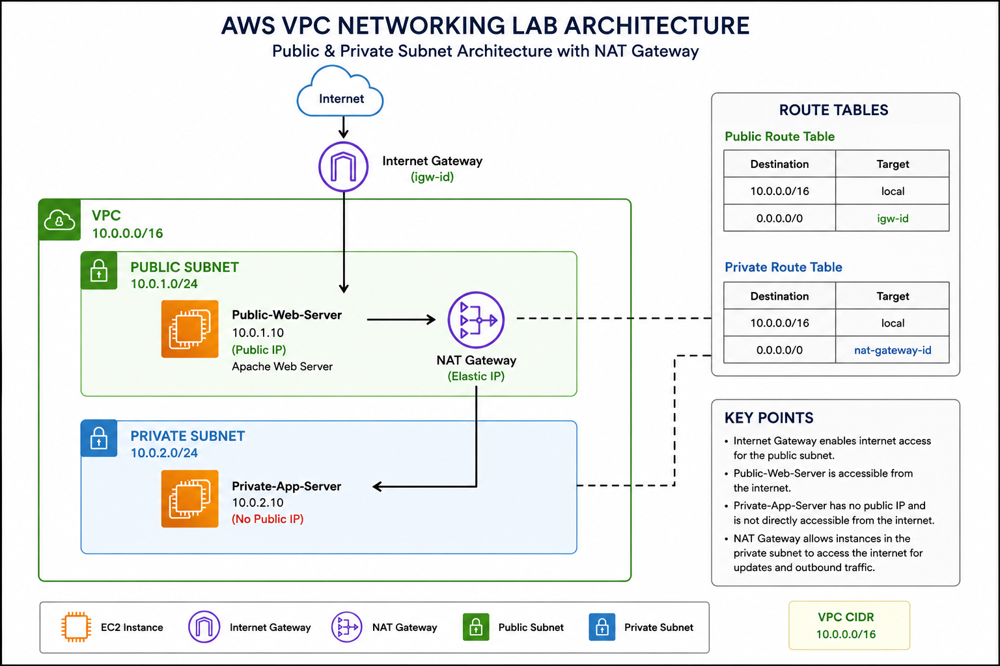
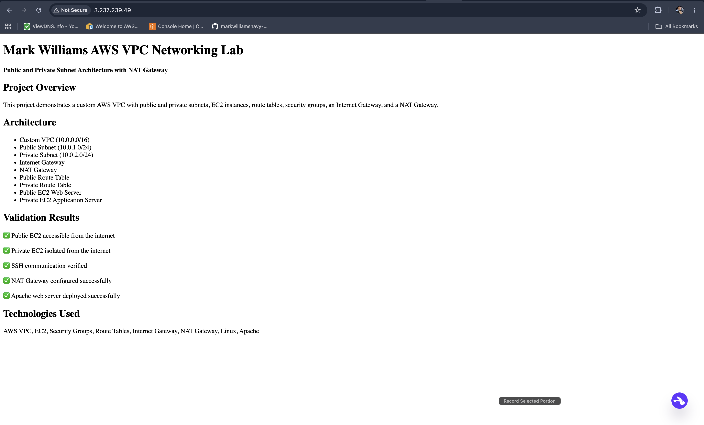
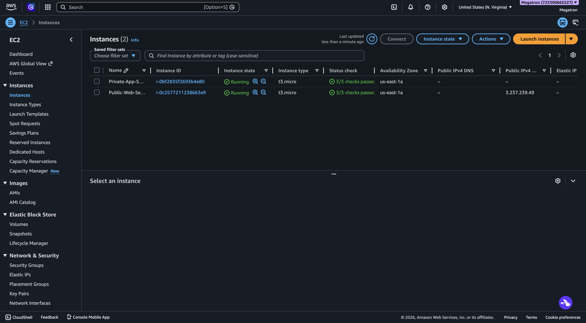
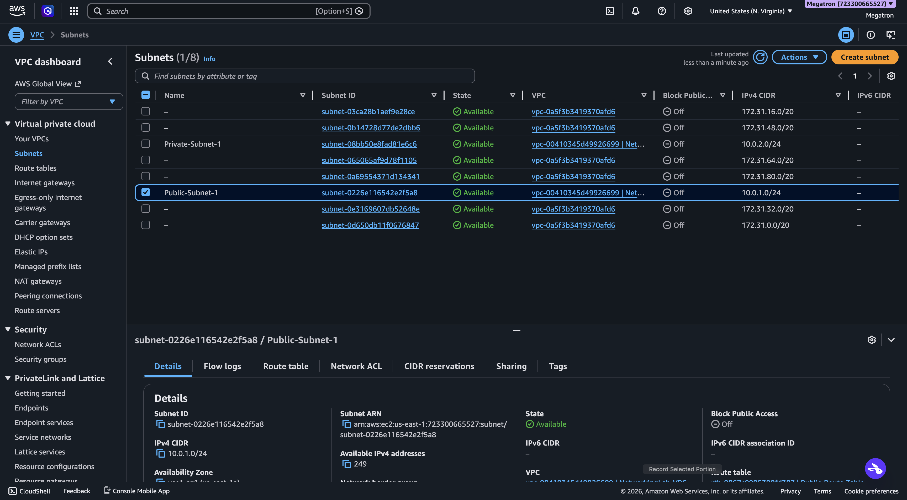
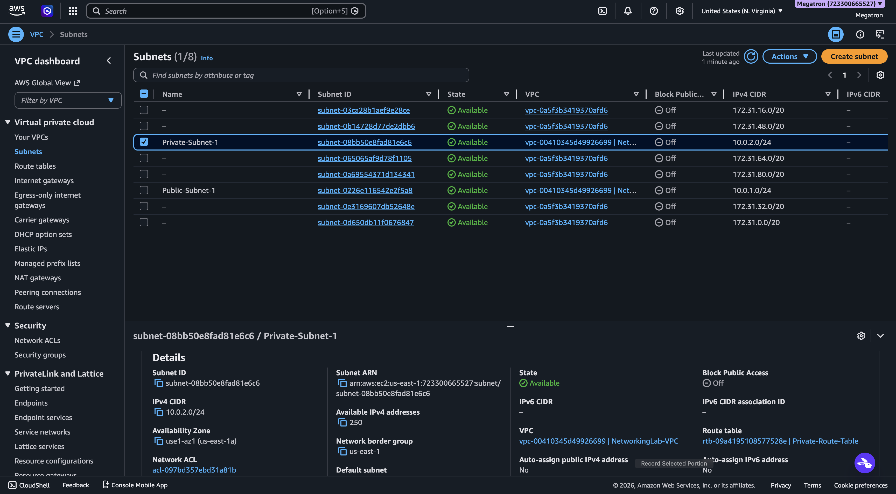
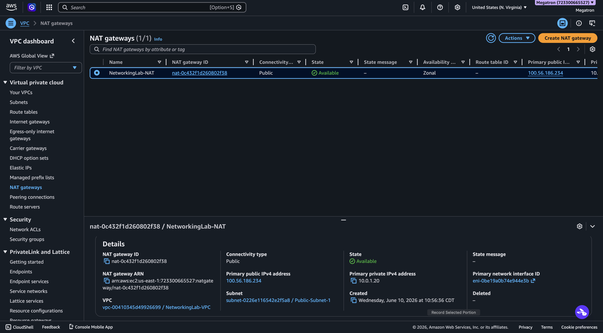
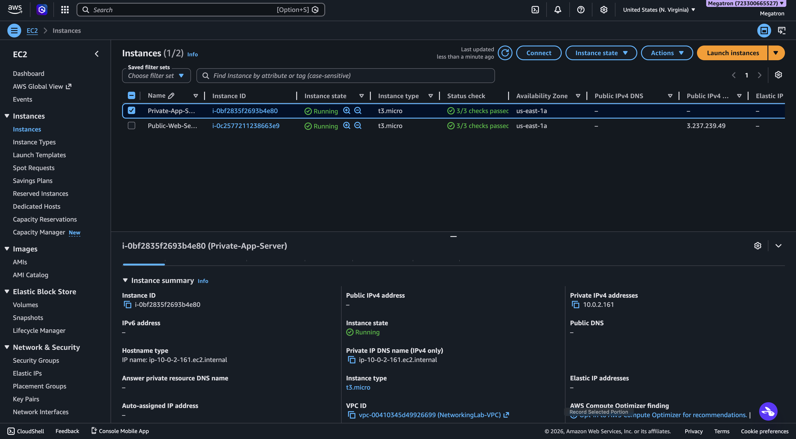

# AWS VPC Networking Lab

## Project Overview

This project demonstrates a custom AWS VPC network architecture using public and private subnets, EC2 instances, route tables, security groups, an Internet Gateway, and a NAT Gateway.

The goal of this project was to build a realistic cloud networking environment that separates public-facing resources from private internal resources while allowing secure outbound internet access from the private subnet.

## Architecture Diagram

## Architecture Summary

- Custom VPC: `10.0.0.0/16`
- Public Subnet: `10.0.1.0/24`
- Private Subnet: `10.0.2.0/24`
- Public EC2 Web Server running Apache
- Private EC2 Application Server with no public IP
- Internet Gateway for public subnet internet access
- NAT Gateway for private subnet outbound internet access
- Security Groups for controlled access
- Route Tables for traffic routing

## Key AWS Services Used

- Amazon VPC
- Amazon EC2
- Internet Gateway
- NAT Gateway
- Route Tables
- Security Groups
- Elastic IP
- Amazon Linux 2023
- Apache Web Server

## What I Built

### Public Subnet

The public subnet contains the Public-Web-Server. This EC2 instance has a public IPv4 address and is accessible from the internet over HTTP.

### Private Subnet

The private subnet contains the Private-App-Server. This EC2 instance does not have a public IPv4 address and cannot be accessed directly from the internet.

### NAT Gateway

A NAT Gateway was deployed in the public subnet to allow the private EC2 instance to make outbound internet requests while remaining inaccessible from inbound internet traffic.

## Validation Results

- Public EC2 instance successfully served an Apache web page over HTTP.
- Private EC2 instance was deployed without a public IPv4 address.
- Security Groups restricted SSH access and controlled network traffic.
- Private route table was updated to send outbound internet traffic through the NAT Gateway.
- Architecture was documented with screenshots and a visual diagram.

## Project Screenshots

### Apache Web Server Validation

### EC2 Instances

### Public Subnet

### Private Subnet

### NAT Gateway

### Private EC2 with No Public IP

## Skills Demonstrated

- AWS VPC design
- Public and private subnet architecture
- Route table configuration
- Internet Gateway configuration
- NAT Gateway configuration
- Security Group management
- EC2 administration
- Linux SSH access
- Apache web server deployment
- Cloud networking troubleshooting
- GitHub documentation

## Resume Summary

Designed and deployed a custom AWS VPC with public and private subnets, EC2 instances, route tables, security groups, Internet Gateway, and NAT Gateway. Configured secure network segmentation and validated outbound internet access for private resources while maintaining private subnet isolation from direct internet traffic.
